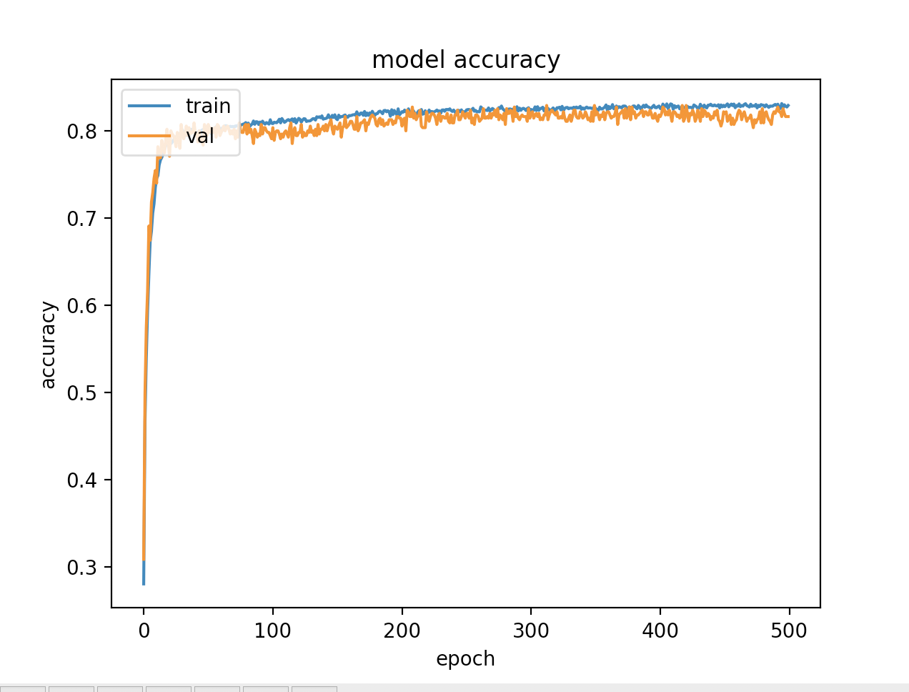
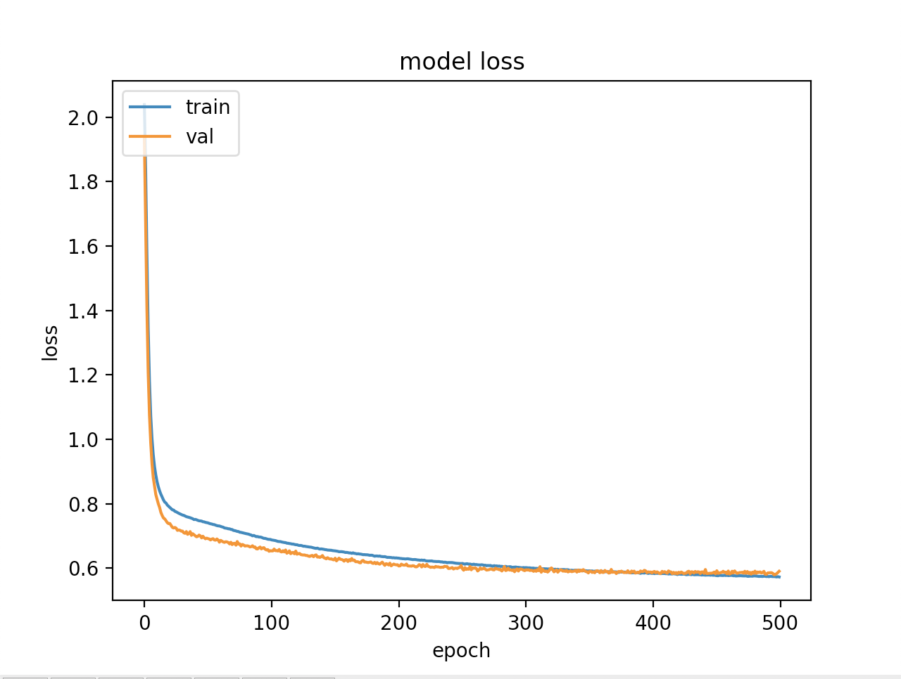

Built a simple color classifier in python using tensorflow and keras. With inspiration and data from https://github.com/CodingTrain/ColorClassifer-TensorFlow.js

# Goal
Build a model that is able to classify any rgb color value to the common string label that a human would give it (ie: "red, green, black, orange, etc")\

# Data

Gathered the bulk of data from https://github.com/CodingTrain/ColorClassifer-TensorFlow.js/blob/master/colorData.json.\
This file contains 5643 crowd-sourced data points that contain an rgb value and a color string label.\
In order to make this data easy to read and store as a text file, formatted it so that each entry has the following format:\
"214,14,85,pink"\
Since the data we used from Coding Train did not have any "black" labeled entries, generated 1,000 of our own by randomly\
generating rgb values where all three values are between 0 and 20.\
This gave a data set of roughly 6500\

# Model

This model is a multi-classifier with 10 possible labels:\
"red",  "green",  "blue",  "orange",  "yellow",  "pink",  "purple",  "brown",  "grey",  "black"\
These labels were encoded with one-hot encoding to 10 binary variables.\
Uses a hidden layer with 16 units and a standard sigmoid activation function.\
The output layer uses a softmax activation function to compute the probability that a training sample belongs to one of the 10 one-hot encoded color classes.\
Trained using the cross-entropy loss function to maximize the loss when the predicted probability diverges from the actual label.\

# Training
Used 5500 data points for training (reserving the other 1000 for testing)\
Learning Rate: 0.2
Number of Epochs: 500

# Results
## Accuracy progression while training

## Loss progression while training

## Post evaluation on training data
Loss 0.57\
Accuracy 0.83\
Precision:  0.86\
Recall:  0.79\
F1 Score:  0.82\

## Post evaluation on testing data
Loss 0.58\
Accuracy 0.82\
Precision:  0.86\
Recall:  0.79\
F1 Score:  0.82\
